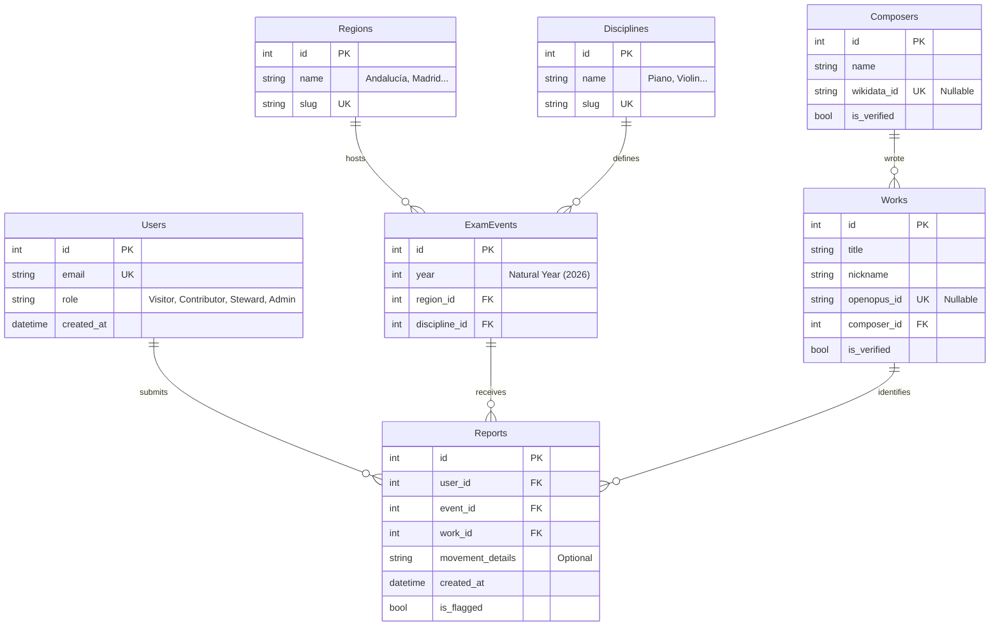

# Technical Specifications: Exam Record

## 1. Technology Stack

### Backend (Core)
*   **Language:** Python 3.12+
*   **Framework:** **FastAPI** (Async).
*   **Database ORM:** **SQLAlchemy (Async)** version 2.0+.
*   **Migrations:** Alembic.
*   **Authentication:** JWT (Stateless) via Magic Link email flow.

### Frontend (Hybrid Approach)
Given the requirement for SEO (browse pages) and complex interactions (data entry), we will use a hybrid stack:
*   **Server-Side Rendering (SSR):** **Jinja2** templates served by FastAPI. Excellent for SEO and initial load speed.
*   **Interactivity:** **HTMX** for partial page reloads (Voting, Search filtering).
*   **Complex State (Data Input):** **Alpine.js** or **Preact** (embedded) for the "Contribution Engine" (Phase 1-3 wizard) which requires instant client-side validation and state management without roundtrips.

### Persistence
*   **Database:** **SQLite** (Development/Beta). Easy to backup and sufficient for the "Constrained Scope" (Andalucía/Piano). Can migrate to PostgreSQL later.
*   **Cache:** In-memory (Dict) or Redis for the "Top 500 Composers" list.

---

## 2. Database Schema (ERD)

The schema is normalized to separate the "Event" (Container) from the "Report" (Vote).

### Key Logic
*   **Consensus Calculation:** We do not store "Consensus" in a table. We calculate it on the fly (or via Materialized View) by aggregating `Reports` grouped by `event_id` and `work_id`.
    *   *Query:* `SELECT work_id, COUNT(*) as votes FROM reports WHERE event_id = X GROUP BY work_id`

---

## 3. API Design (Key Endpoints)

### auth
*   `POST /auth/magic-link`: Sends email with token.
*   `GET /auth/verify?token=...`: Sets HTTP-only cookie session.

### search
*   `GET /exams/{region}/{discipline}/{year}`: Returns the Exam Event page with list of proposed works + consensus status.
    *   *Response:* HTML (SSR).

### submission (The Contribution Engine)
*   `GET /api/composers/search?q=...`: Proxy to local cache or Wikidata.
*   `GET /api/works/search?q=...`: Proxy to local cache or OpenOpus.
*   `POST /api/reports`: Submits a new exam report.
    *   *Payload:* `{ event_id, work_data: {...}, composer_data: {...} }`
    *   *Logic:* Handles "Get or Create" for Composers/Works.

### moderation
*   `POST /api/reports/{id}/flag`: Flags an entry.
*   `POST /api/reports/{id}/vote`: Quick "Me too" vote (creates a new Report with same Work ID).

---

## 4. External Integrations
*   **Wikidata SPARQL Wrapper:** For resolving composer names / dates.
*   **OpenOpus API:** For work catalog numbers.
*   *Strategy:* We will build a `services/metadata.py` module to abstract these external calls and handle caching/rate-limiting.
